# Chama o Síndico

**Ana Júlia Teixeira Candido, anajuliateixeiracandido@gmail.com**

**Davi José Ferreira, daviferreiradev@gmail.com**

**Marcella Ferreira Chaves Costa, marcellafccosta@gmail.com**

**Sophia Mendes Rabelo, sophiamendesrabelo@gmail.com**

**Thiago Andrade Ramalho, thiandrade79@gmail.com**

---

Professores:

**Prof. Artur Martins Mol**

**Prof. Leonardo Vilela Cardoso**

---

_Curso de Engenharia de Software, Campus Coração Eucarístico_

_Instituto de Informática e Ciências Exatas – Pontifícia Universidade de Minas Gerais (PUC MINAS), Belo Horizonte – MG – Brasil_

---

Este projeto visa melhorar a comunicação e a gestão em condomínios, abordando as limitações do uso de grupos de WhatsApp para a administração de condomínios no geral, registro de ocorrências e resolução de problemas. A pesquisa realizada pelo grupo revelou que a dependência dessa ferramenta gera riscos relacionados à privacidade e à segurança das informações, além de ser disfuncional e inconveniente. Embora prático, o WhatsApp se torna uma solução desorganizada e ineficiente para a gestão condominial. O projeto propõe alternativas para centralizar e organizar as atividades do condomínio, garantindo mais segurança, transparência e eficiência, ao mesmo tempo em que assegura o respeito às normas legais e à privacidade dos moradores.

---

## Histórico de Revisões

| **Data** | **Autor** | **Descrição** | **Versão** |
| --- | --- | --- | --- |
| **[dd/mm/aaaa]** | [Nome do autor] | [Descrever as principais alterações realizadas no documento, evidenciando as seções ou capítulos alterados] | [X] |
| | | | |
| | | | |

## SUMÁRIO

1. [Apresentação](#apresentacao "Apresentação")  
	1.1. Problema  
	1.2. Objetivos do trabalho  
	1.3. Definições e Abreviaturas  
 
2. [Nosso Produto](#produto "Nosso Produto")  
	2.1. Visão do Produto  
   	2.2. Nosso Produto  
   	2.3. Personas  

3. [Requisitos](#requisitos "Requisitos")  
	3.1. Requisitos Funcionais  
	3.2. Requisitos Não-Funcionais  
	3.3. Restrições Arquiteturais  
	3.4. Mecanismos Arquiteturais  

4. [Modelagem](#modelagem "Modelagem e projeto arquitetural")  
	4.1. Visão de Negócio  
	4.2. Visão Lógica  
	4.3. Modelo de dados (opcional)  

5. [Wireframes](#wireframes "Wireframes")  

6. [Solução](#solucao "Projeto da Solução")  

7. [Avaliação](#avaliacao "Avaliação da Arquitetura")  
	7.1. Cenários  
	7.2. Avaliação  

8. [Apêndices](#apendices "APÊNDICES") 
	8.1 Ferramentas  

# 1. Apresentação

De acordo com uma pesquisa realizada pelo nosso grupo com síndicos de diversos condomínios, constatamos que atualmente 80% dos registros de ocorrências e problemas no condomínio são feitos por meio de grupos de WhatsApp. Esses dados revelam uma dependência significativa dessa ferramenta de comunicação instantânea na gestão condominial, o que levanta importantes questões sobre eficiência, organização e segurança das informações compartilhadas.

Neste projeto, vamos explorar e analisar os desafios complexos enfrentados pelos condomínios devido à gestão ineficaz e desorganizada, especialmente no contexto da comunicação digital. Essa problemática tem impactado diretamente o cotidiano dos moradores e, principalmente, a rotina dos síndicos, que frequentemente se veem sobrecarregados pela falta de ferramentas adequadas para lidar com as demandas do condomínio.

O uso de grupos de WhatsApp como principal canal de comunicação entre moradores, síndicos e administradores tem se tornado uma prática comum. No entanto, essa solução aparentemente simples apresenta diversas limitações e riscos, especialmente quando analisada sob a perspectiva da Lei Geral de Proteção de Dados (LGPD) e da necessidade de uma comunicação eficiente e organizada.

## 1.1. Problema

O uso de grupos de WhatsApp como principal ferramenta para registrar ocorrências e tratar problemas no condomínio tem se mostrado uma prática comum entre síndicos. Apesar de sua acessibilidade e praticidade, essa abordagem apresenta diversas complicações. Informações pessoais, como nome e número de telefone, são frequentemente compartilhadas nesses grupos sem um controle adequado sobre quem pode acessar esses dados ou como eles serão utilizados. Essa falta de regulamentação representa um risco significativo à privacidade dos moradores e ao cumprimento das normas estabelecidas pela LGPD.

Além disso, muitos dos participantes desses grupos não possuem conhecimento adequado sobre as normas de proteção de dados, o que pode levar ao uso indevido ou à divulgação não autorizada de informações sensíveis. A ausência de regulamentação e monitoramento eficazes agrava ainda mais esse problema, expondo os moradores e síndicos a potenciais conflitos legais e éticos.

Outro desafio crítico é a falta de comunicação eficiente entre moradores, síndicos e administradores. Muitas vezes, as informações são repassadas de forma incorreta ou não chegam a todos os envolvidos, resultando em atrasos na resolução de problemas, insatisfação geral e até mesmo conflitos internos. A dependência excessiva do WhatsApp como principal canal de comunicação e gestão em condomínios evidencia a necessidade urgente de soluções mais estruturadas, seguras e eficientes.
Portanto, este projeto busca propor alternativas que atendam às demandas atuais dos condomínios, garantindo maior eficiência na gestão e maior conformidade com as normas de proteção de dados, além de proporcionar um ambiente mais organizado e colaborativo para todos os envolvidos.

## 1.2. Objetivos do trabalho

O objetivo geral deste trabalho é apresentar a descrição do projeto arquitetural de um aplicativo voltado para a gestão de condomínios. O intuito é criar uma ferramenta prática e eficiente que centralize todas as necessidades de comunicação e organização entre os moradores, síndicos e demais funcionários do condomínio.
1. **Proteger a privacidade dos condôminos e do síndico**  
   O desenvolvimento de um chat interno no aplicativo permitirá que as conversas sejam focadas exclusivamente em assuntos do condomínio, evitando o compartilhamento desnecessário de números de telefone.

2. **Centralizar as atividades do condomínio**  
   A implementação de um sistema de registro de ocorrências e um quadro de avisos digital permitirá que todas as informações relevantes estejam disponíveis em um único local, facilitando o acesso e a comunicação entre os moradores e a administração.

3. **Organizar as atividades administrativas**  
   Com o sistema de registro de manutenções e o sistema de prestação de contas, será possível ter um controle mais efetivo das tarefas realizadas, programar futuras ações e proporcionar transparência na gestão financeira do condomínio.

4. **Melhorar a logística de entrega de encomendas**  
   A criação de um sistema de notificação de encomendas irá otimizar o processo de recebimento de pacotes, evitando transtornos e garantindo que os moradores sejam informados prontamente sobre suas entregas.

5. **Ter controle das operações e serviços**  
   O registro de ocorrências e manutenções permitirá um acompanhamento detalhado de todos os incidentes e trabalhos realizados no condomínio, garantindo que nada seja esquecido ou negligenciado.

6. **Promover a transparência na gestão do condomínio**  
   Através do sistema de prestação de contas, todos os moradores poderão ter acesso às informações sobre receitas e despesas, contribuindo para uma gestão mais transparente e confiável.

Ao concentrar nossa atenção nesses pontos, esperamos desenvolver um aplicativo que não apenas facilite a vida dos síndicos e moradores, mas também promova a privacidade e segurança de todos os envolvidos.

## 1.3. Definições e Abreviaturas
- CoS: Chama o Síndico
- LGPD: Lei Geral de Proteção de Dados

# 2. Nosso Produto

_Estão seção explora um pouco mais o produto a ser desenvolvido_

## 2.1 Visão do Produto

## 2.2 Nosso Produto
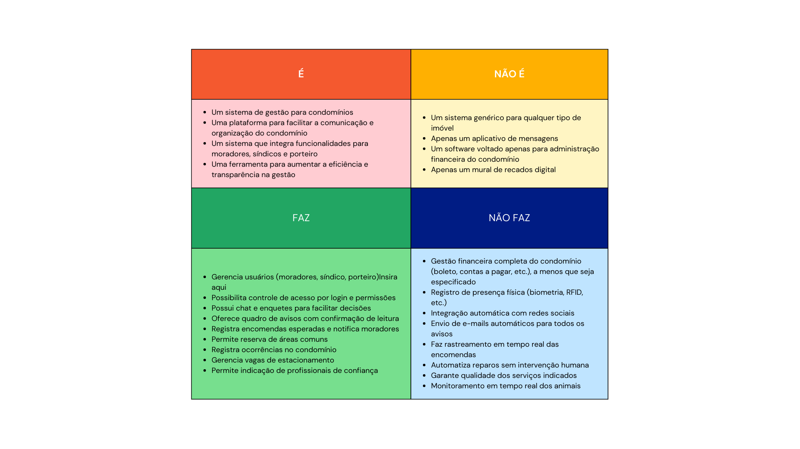

## 2.3 Personas
<h2>Persona 1</h2>
<table>
  <tr>
    <td style="vertical-align: top; width: 150px;">
      
    </td>
    <td style="vertical-align: top; padding-left: 10px;">
      <strong>Nome:</strong> Marcos Almeida  
      <strong>Idade:</strong> 45 anos  
      <strong>Hobby:</strong> Jardinagem  
      <strong>Trabalho:</strong> Síndico profissional  
      <strong>Personalidade:</strong> Organizado, comunicativo e proativo  
      <strong>Sonho:</strong> Ser referência em gestão condominial moderna  
      <strong>Dores:</strong> Dificuldade em centralizar informações e manter todos os moradores informados sem depender de grupos de WhatsApp  
    </td>
  </tr>
</table>

<h2>Persona 2</h2>
<table>
  <tr>
    <td style="vertical-align: top; width: 150px;">
      
    </td>
    <td style="vertical-align: top; padding-left: 10px;">
      <strong>Nome:</strong> Juliana Ribeiro  
      <strong>Idade:</strong> 34 anos  
      <strong>Hobby:</strong> Fazer yoga  
      <strong>Trabalho:</strong> Analista de marketing  
      <strong>Personalidade:</strong> Discreta, prática e colaborativa  
      <strong>Sonho:</strong> Morar em um condomínio tranquilo e bem organizado  
      <strong>Dores:</strong> Falta de privacidade e dificuldade para acompanhar os gastos do condomínio  
    </td>
  </tr>
</table>

<h2>Persona 3</h2>
<table>
  <tr>
    <td style="vertical-align: top; width: 150px;">
      
    </td>
    <td style="vertical-align: top; padding-left: 10px;">
      <strong>Nome:</strong> Pedro Henrique Costa  
      <strong>Idade:</strong> 27 anos  
      <strong>Hobby:</strong> Jogar videogame  
      <strong>Trabalho:</strong> Entregador de encomendas  
      <strong>Personalidade:</strong> Ágil, observador e simpático  
      <strong>Sonho:</strong> Ter um negócio próprio de logística  
      <strong>Dores:</strong> Desorganização na entrega de pacotes e dificuldades para localizar os moradores no momento da entrega  
    </td>
  </tr>
</table>

<h2>Persona 4</h2>
<table>
  <tr>
    <td style="vertical-align: top; width: 150px;">
      
    </td>
    <td style="vertical-align: top; padding-left: 10px;">
      <strong>Nome:</strong> Dona Célia Matos  
      <strong>Idade:</strong> 68 anos  
      <strong>Hobby:</strong> Bordar e cuidar dos netos  
      <strong>Trabalho:</strong> Aposentada (ex-professora de História)  
      <strong>Personalidade:</strong> Amável, atenta aos detalhes e tradicional  
      <strong>Sonho:</strong> Viver com tranquilidade e segurança em seu lar  
      <strong>Dores:</strong> Dificuldade em acessar informações importantes do condomínio e sentir-se excluída das decisões por não usar redes sociais  
    </td>
  </tr>
</table>

# 3. Requisitos

_Esta seção descreve os requisitos comtemplados nesta descrição arquitetural, divididos em dois grupos: funcionais e não funcionais._

## 3.1. Requisitos Funcionais

_Enumere os requisitos funcionais previstos para a sua aplicação. Concentre-se nos requisitos funcionais que sejam críticos para a definição arquitetural. Lembre-se de listar todos os requisitos que são necessários para garantir cobertura arquitetural. Esta seção deve conter uma lista de requisitos ainda sem modelagem. Na coluna Prioridade utilize uma escala (do mais prioritário para o menos): Essencial, Desejável, Opcional._

| **ID**    | **Descrição**                                   | **Prioridade** | **Plataforma**      | **Sprint**  | **Status** |
|-----------|------------------------------------------------|----------------|---------------------|-------------|------------|
| RF001     | Cadastro de Usuários/Apartamentos, controle de acesso | Essencial           |    web             |  3    |         |
| RF002     | Chat                                           | Essencial           |   mobile     | 4    |            |
| RF003     | Quadro de Avisos                               | Essencial      |  mobile (exibição) e web (entrada de dados)    |     3        |            |
| RF004     | Registro de Encomendas                         | Desejável          |            web         |     4        |            |
| RF005     | Sistemas de Notificações                       | Desejável          |          mobile           |    4         |            |
| RF006     | Reserva de Áreas Comuns                        | Desejável          |                mobile     |     3        |            |
| RF007     | Registro de Ocorrências                        | Desejável          |         web            |       3      |            |
| RF008     | Controle de Entrada e Saída de Visitantes      | Essencial           |         mobile            | 4            |            |
| RF009     | Controle de Vagas de Estacionamento            | Desejável          |            mobile         |    4         |            |
| RF010     | Indicação de Profissionais de Confiança        | Desejável          | mobile (exibição) e web (entrada de dados) |   4          |            |
| RF011     | Termo de Consentimento                         | Desejável          |       mobile              |  4           |         |
| RF012     | Manutenção Preventiva e Preditiva              | Desejável          |  mobile (exibição) e web (entrada de dados)      | 3            |            |
| RF013 EXTRA  | Prestação de Contas                            | Opcional          | mobile (exibição) e web (entrada de dados)            |             |            |
| RF014 EXTRA  | Cadastro de Animais de Estimação               | Opcional          |        web             |             |

## 3.2. Requisitos Não-Funcionais

| **ID**   | **Descrição** |
|----------|---------------------------------------------------------------------------------------------------------------------------------------------------------------|
| RNF001   | O sistema deve ser compatível com os principais navegadores web (Chrome, Opera, Edge, Safari) e sistemas operacionais móveis (Android, iOS).                |
| RNF002   | A interface do usuário deve ser intuitiva e responsiva, facilitando o uso por todos os perfis de moradores.                                                   |
| RNF003   | O sistema deve registrar logs em tempo real utilizando Kafka para funcionalidades que demandam processamento imediato das informações.                        |
| RNF004   | O sistema deve permitir fácil atualização e manutenção, sem necessidade de downtime superior a 1 dia.                                                         |
| RNF005   | O sistema deve garantir conformidade com a LGPD (Lei Geral de Proteção de Dados), incluindo consentimento explícito para uso de dados pessoais.               |
| RNF006   | As senhas dos usuários devem ser armazenadas utilizando criptografia.              		                              			           |
| RNF007   | Os moradores não devem ter acesso aos dados sensíveis uns dos outros; apenas síndico e funcionários têm acesso à informação do apartamento (dado sensível).   |

## 3.3. Restrições Arquiteturais

As restrições impostas ao projeto que afetam sua arquitetura são:

- O frontend da aplicação deve ser desenvolvido utilizando **Flutter**, garantindo portabilidade entre web e mobile.
- O sistema deve obrigatoriamente implementar mecanismos de mensageria.
- O sistema deve obrigatoriamente implementar uma funcionalidade em tempo real.
- Deve ser realizado o deploy web e deve ser gerado também um arquivo **APK** para distribuição mobile.
- O sistema deve possuir testes automatizados para garantir a qualidade e integridade das funcionalidades.

## 3.4. Mecanismos Arquiteturais

_Visão geral dos mecanismos que compõem a arquitetura do sosftware baseando-se em três estados: (1) análise, (2) design e (3) implementação. Em termos de Análise devem ser listados os aspectos gerais que compõem a arquitetura do software como: persistência, integração com sistemas legados, geração de logs do sistema, ambiente de front end, tratamento de exceções, formato dos testes, formato de distribuição/implantação (deploy), entre outros. Em Design deve-se identificar o padrão tecnológico a seguir para cada mecanismo identificado na análise. Em Implementação, deve-se identificar o produto a ser utilizado na solução.
 Ex: Análise (Persistência), Design (ORM), Implementação (Hibernate)._

| **Análise** | **Design** | **Implementação** |
| --- | --- | --- |
| Persistência | Armazenamento e acesso a dados | PostgreSQL |
| Front end | Desenvolvimento web responsivo, framework de UI | Flutter  |
| Back end | API RESTful, MVC | Node.js e Nest.js |
| Integração | Comunicação entre camadas, consumo de API REST | RESTful API via Node.js |
| Log do sistema | Sistema de log com nivelamento de severidade | |
| Teste de Software | Testes unitários, testes de integração | Jest  |
| Deploy | Infraestrutura de deploy e CI/CD | Render e Vercel |

# 4. Modelagem e Projeto Arquitetural

## 4.1. Visão de Negócio (Funcionalidades)

1. O sistema deve permitir o cadastro de usuários e apartamentos com controle de acesso diferenciado, garantindo que apenas moradores autorizados tenham acesso às funcionalidades do condomínio através da plataforma.Add commentMore actions
2. O sistema deve fornecer a funcionalidade de chat em tempo real para comunicação entre moradores através da aplicação mobile, facilitando a interação dos condôminos
3. O sistema deve disponibilizar um quadro de avisos digital onde informações importantes possam ser visualizadas pelos moradores e gerenciadas pelo síndico.
4. O sistema deve controlar a entrada e saída de visitantes, permitindo registro, autorização e monitoramento de acesso ao condomínio.
5. O sistema deve permitir o registro e controle de encomendas recebidas no condomínio, facilitando a gestão da portaria.
6. O sistema deve implementar um sistema de notificações para manter os moradores informados sobre os avisos e mensagens do chat através da aplicação mobile.
7. O sistema deve possibilitar a reserva de áreas comuns do condomínio pelos moradores, evitando conflitos de uso.
8. O sistema deve permitir o registro de ocorrências condominiais.
9. O sistema deve gerenciar o controle de vagas de estacionamento, permitindo reserva e monitoramento de ocupação.
10. O sistema deve disponibilizar uma funcionalidade de indicação de profissionais de confiança, onde moradores possam visualizar e síndico gerenciá-las.Add commentMore actions
11. O sistema deve apresentar e gerenciar termos de consentimento para uso da plataforma, garantindo conformidade legal.
12. O sistema deve oferecer funcionalidades de manutenção preventiva e preditiva, para otimizar a gestão condominial.

### Histórias de Usuário

|EU COMO... `PERSONA`| QUERO/PRECISO ... `FUNCIONALIDADE` |PARA ... `MOTIVO/VALOR`                 |
|--------------------|------------------------------------|----------------------------------------|
|Usuário do sistema  | Me cadastrar no aplicativo Chama o Síndico           | Ter acesso completo às funcionalidades do aplicativo |
|Condômino       | Cadastrar meu apartamento no sistema | Comprovar que sou residente e poder utilizar o aplicativo |
|Usuário do sistema  | Utilizar um chat em tempo real  | Discutir informações e decisões de forma colaborativa com outros moradores |
|Síndico ou funcionário | Publicar avisos no aplicativo | Manter todos os moradores informados sobre comunicados |
|Condômino  | Visualizar os avisos publicados | Me manter informado sobre comunicados, eventos e atualizações do condomínio |
|Condômino |Registrar a chegada de uma encomenda | Notificar o porteiro para entrega organizada e segura |
|Funcionário  | Confirmar a entrega de uma encomenda | Notificar o condômino e confirmar o recebimento |
|Condômino | Registrar ocorrências no aplicativo | Relatar problemas no condomínio e acompanhar seu andamento |
|Usuário do sistema  | Receber notificações do aplicativo | Ser informado sobre atualizações mesmo com o app fechado |
|Condômino | Reservar áreas comuns do condomínio  | Garantir uso exclusivo em horários disponíveis de forma prática e organizada |
|Condômino  | Cadastrar visitantes           | Informar o porteiro sobre quem entra e sai do condomínio |
|Funcionário       | Controlar entrada e saída de visitantes  | Manter o controle de acesso e a segurança do condomínio |
|Condômino  | 	Cadastrar profissionais de confiança | Compartilhar boas recomendações com meus vizinhos  |
|Condômino | Visualizar indicações de profissionais | Entrar em contato com profissionais recomendados por outros moradores |
|Condômino  | Cadastrar manutenções preditivas e/ou preventiva | Informar os moradores sobre cuidados realizados e planejados na infraestrutura |
|Síndico | Atualizar o status das manutenções |	Manter os moradores cientes da situação de cada manutenção |
|Usuário do sistema | Visualizar as manutenções e seus status | Acompanhar as ações de manutenção do condomínio |
|Usuário do sistema | Visualizar e aceitar os termos de consentimento  | Entender como meus dados serão tratados e as leis respeitadas pelo sistema |

## 4.2. Visão Lógica

_Apresente os artefatos que serão utilizados descrevendo em linhas gerais as motivações que levaram a equipe a utilizar estes diagramas._

### Diagrama de Classes

**Figura 2 – Diagrama de classes.**

A Figura 2 apresenta o diagrama de classes do sistema "Chama o Síndico", representando as principais entidades do condomínio, como Usuário, Apartamento, Ocorrência, Encomenda, Visitante, Reserva e Manutenção, além de seus atributos e relacionamentos. O diagrama mostra como os usuários, classificados por papéis (síndico, funcionário ou condômino), interagem com o sistema, permitindo funcionalidades como registro de ocorrências, reservas de áreas comuns, recebimento de encomendas e controle de visitantes. A estrutura serve como base para o desenvolvimento da aplicação e do banco de dados.

### Diagrama de componentes
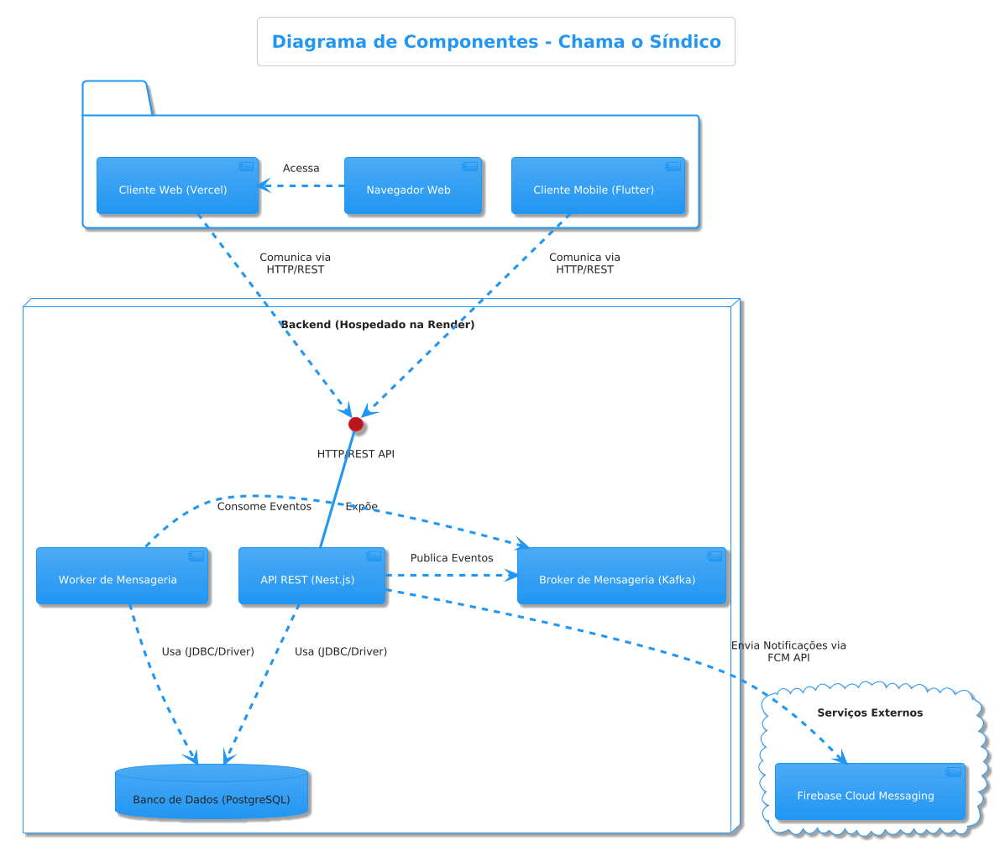

## Descrição Concisa dos Artefatos de Implantação

Conforme o diagrama, os artefatos e nós da arquitetura são:

### **Cliente Mobile (Flutter)**

Aplicação nativa (iOS/Android) em Flutter que serve como interface principal para os usuários. Executa no dispositivo do cliente e consome a API REST para realizar todas as operações do sistema.

### **Cliente Web (Vercel)**

Aplicação web responsiva, implantada na Vercel, que serve como alternativa de acesso via navegador, com foco em funcionalidades administrativas. Interage exclusivamente com a API REST.

### **API REST (Nest.js)**

Servidor backend em Node.js/Nest.js, implantado na Render. Centraliza a lógica de negócio, autenticação e validação, expondo uma API REST para os clientes. Orquestra a comunicação com o banco de dados e o broker de mensageria.

### **Worker de Mensageria**

Processo de backend assíncrono ("Background Worker") implantado na Render. Consome mensagens do Kafka para executar tarefas em segundo plano (ex: notificações), garantindo a agilidade da API principal.

### **Banco de Dados (PostgreSQL)**

Banco de dados relacional (PostgreSQL) hospedado na Render. Armazena todos os dados da aplicação e é acessado tanto pela API REST quanto pelo Worker para operações de leitura e escrita.

### **Broker de Mensageria (Kafka)**

Plataforma de eventos (Apache Kafka) que atua como intermediário para a comunicação assíncrona. Desacopla a API (produtor) do Worker (consumidor), garantindo a entrega de mensagens de forma resiliente.

### **Firebase Cloud Messaging (FCM)**

Serviço externo do Google (BaaS) integrado à solução para gerenciar o envio de notificações push aos dispositivos móveis. É acionado pelo backend para alertar os usuários sobre atualizações importantes.

# 5. Wireframes

> Wireframes são protótipos das telas da aplicação usados em design de interface para sugerir a
> estrutura de um site web e seu relacionamentos entre suas
> páginas. Um wireframe web é uma ilustração semelhante ao
> layout de elementos fundamentais na interface.

### Tela de Login
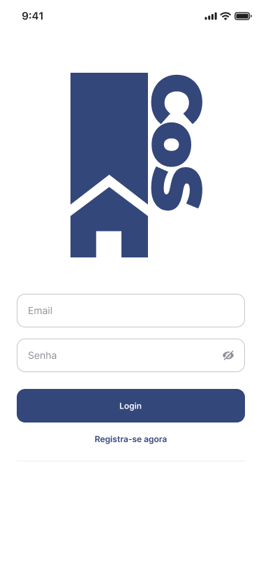

### Tela de Chat
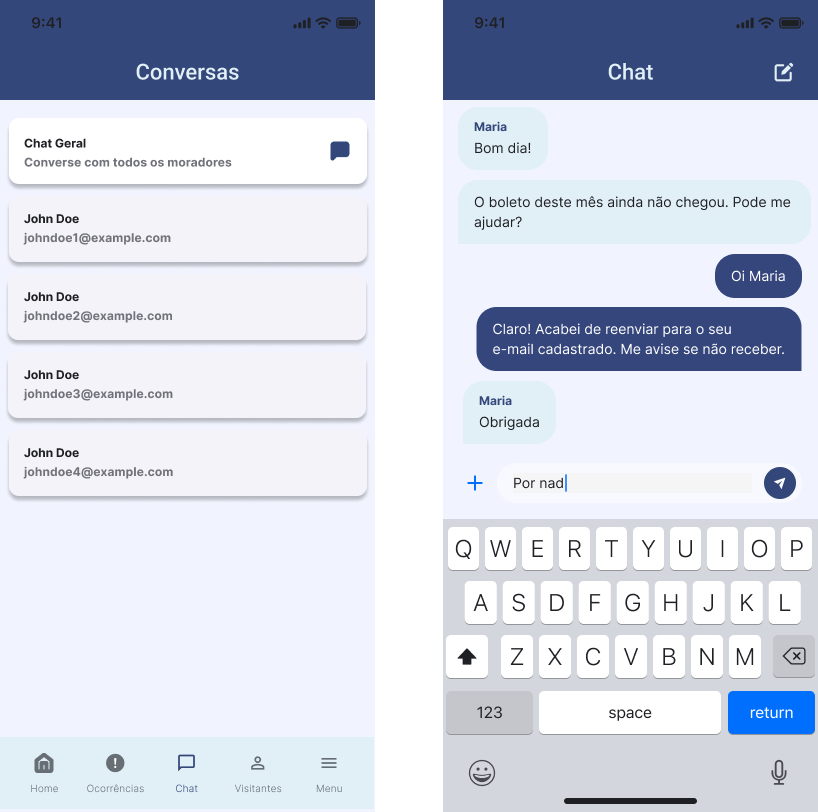

### Tela de Perfil
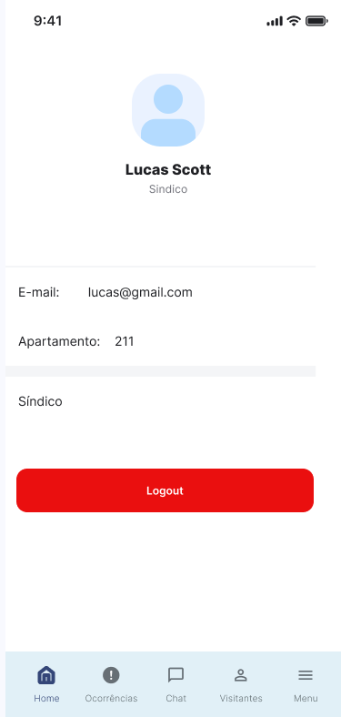

### Tela de Reserva de Área
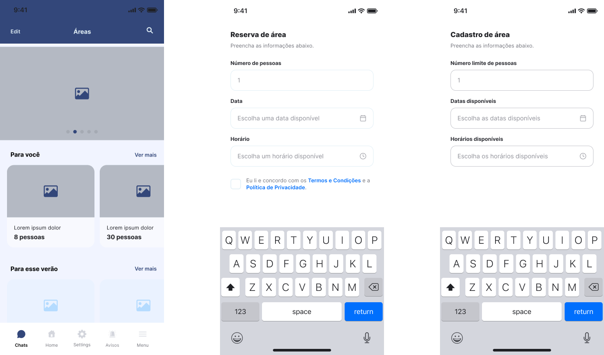

### Tela de Manutenção
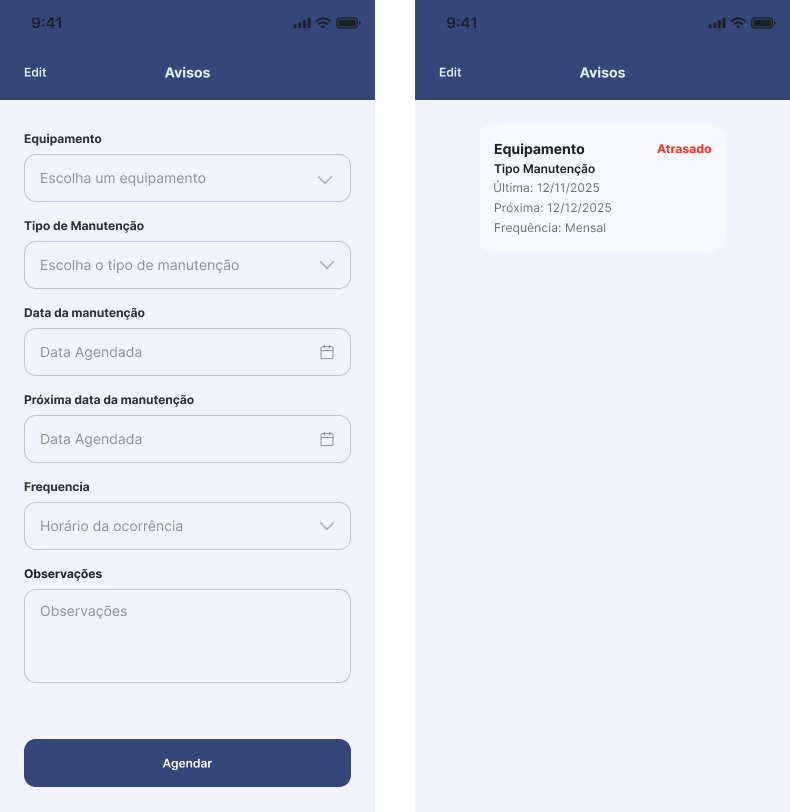

### Tela de Ocorrência
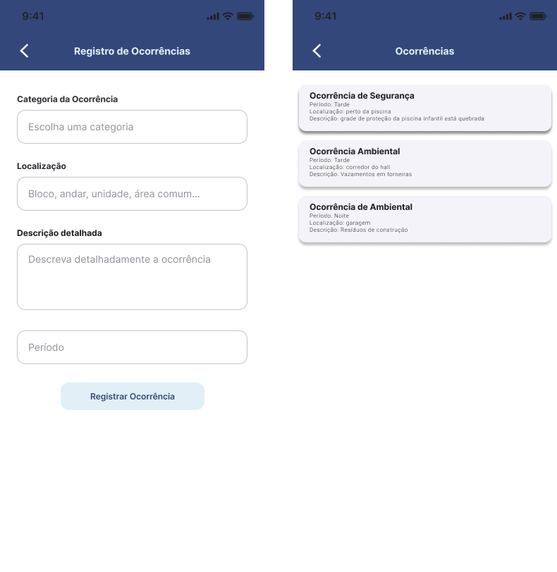

### Tela de Encomenda
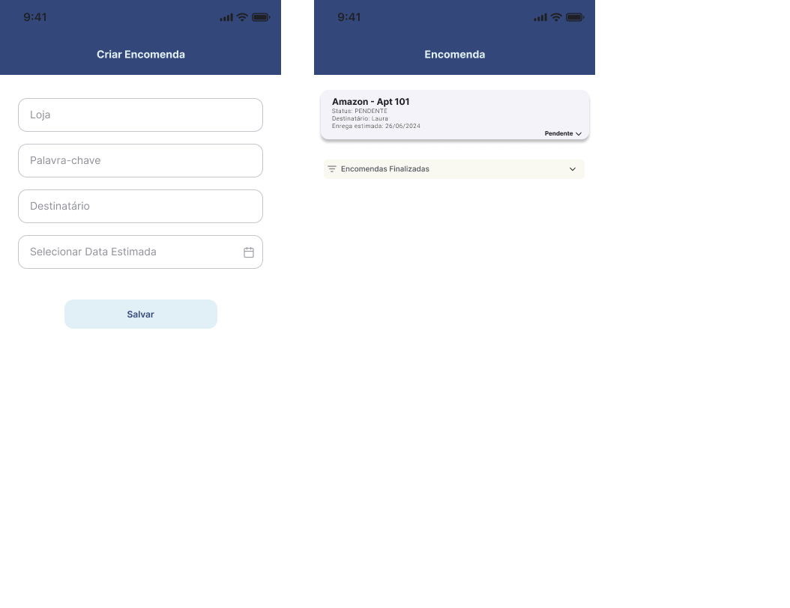

### Tela de Vagas
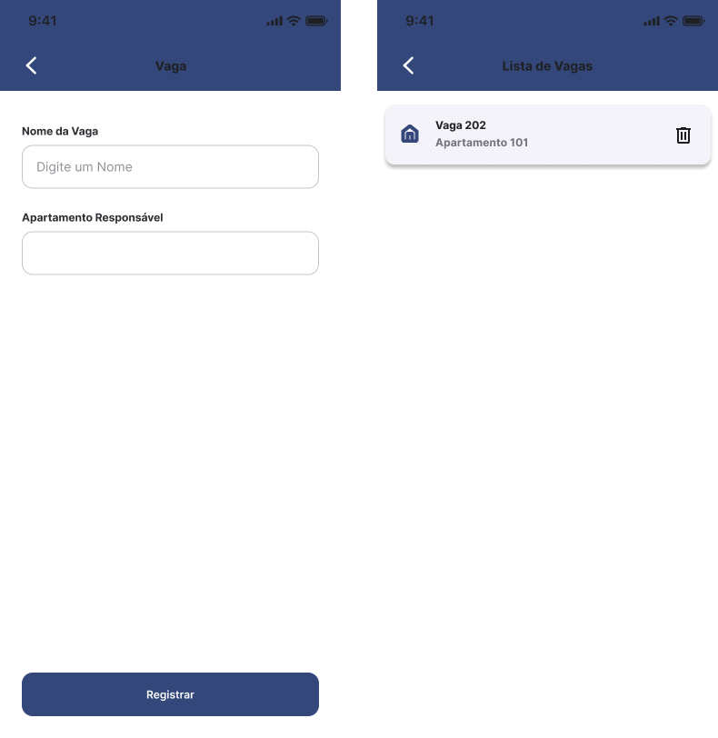

### Tela de Avisos
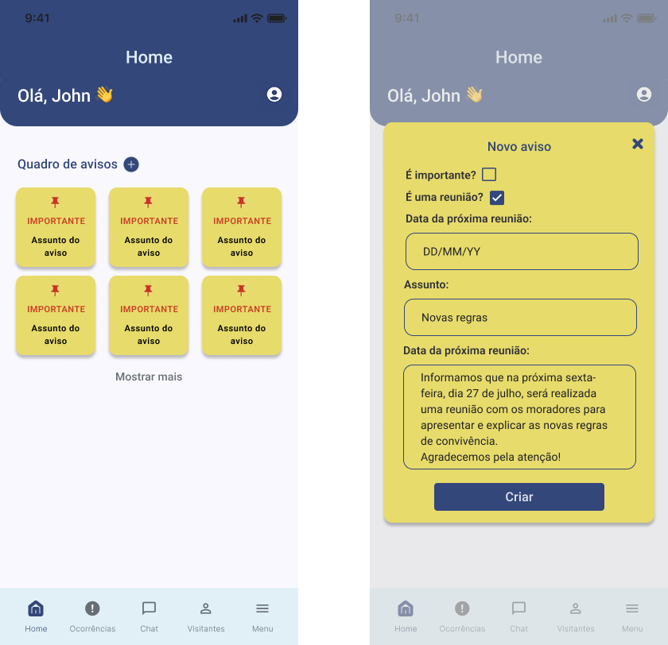

### Tela de Cadastro
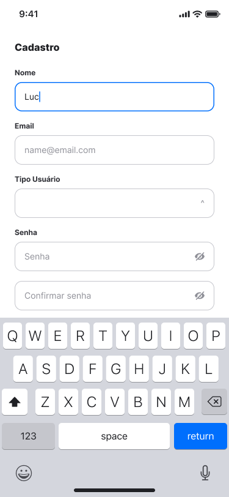

### Tela de Visitantes

### Tela de Apartamentos
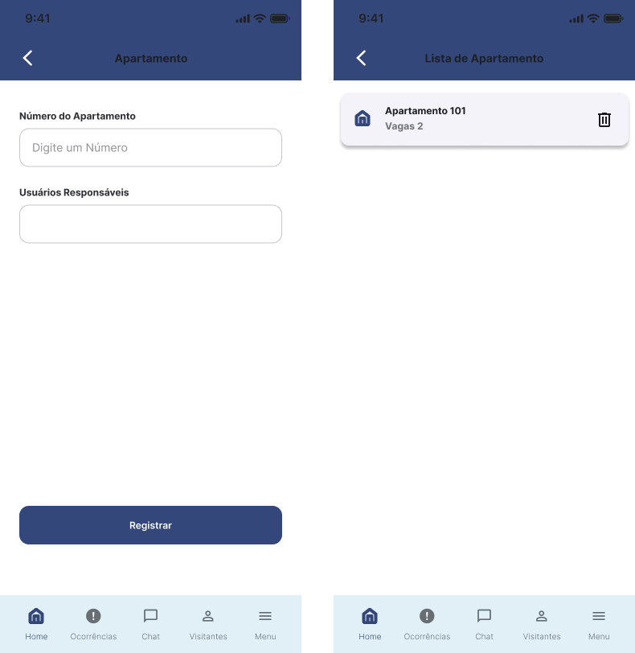

# 6. Projeto da Solução

### Tela de Áreas Comuns

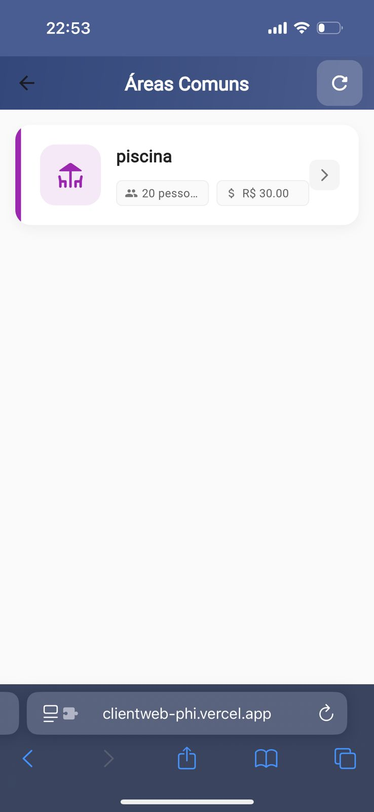

Permite visualizar as áreas disponíveis para reserva, como piscina, com informações sobre capacidade máxima e valor cobrado.

---

### Tela de Chat Geral

Espaço de comunicação coletiva entre os moradores, onde todos podem trocar mensagens públicas.

---

### Tela de Conversas Individuais

Exibe a lista de conversas privadas com outros moradores, possibilitando o envio de mensagens diretas.

---

### Tela Inicial (Home)

Apresenta uma saudação personalizada ao usuário, com acesso rápido às principais funcionalidades e ao quadro de avisos.

---

### Tela de Manutenções

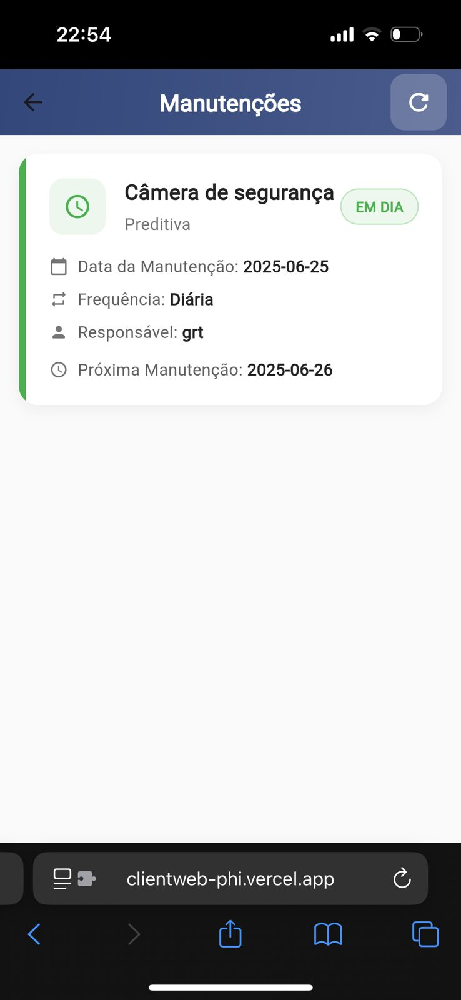

Lista os serviços de manutenção cadastrados, informando tipo, data, frequência, responsável e status da atividade.

---

### Tela de Ocorrências

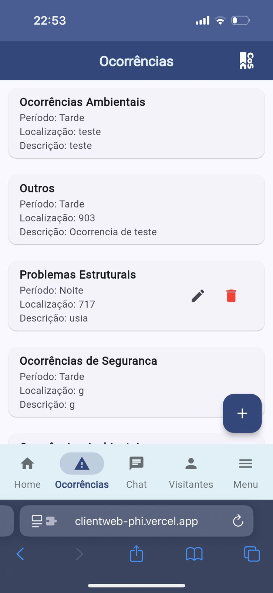

Permite ao morador registrar e acompanhar diferentes tipos de ocorrências no condomínio, com detalhes como local, descrição e categoria.

---

### Tela de Perfil do Usuário

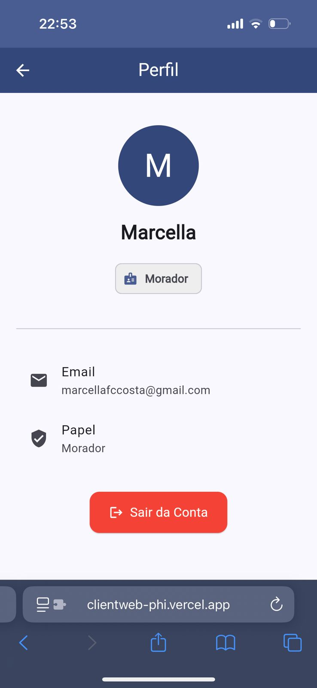

Mostra as informações do usuário logado, como nome, e-mail, papel (morador, síndico, etc.) e opção para sair da conta.

---

### Tela de Indicação de Profissionais

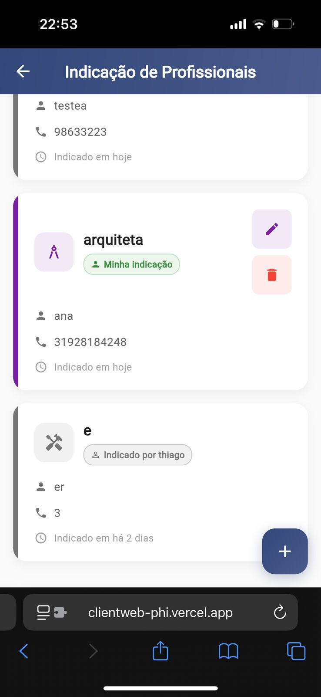

Exibe os profissionais recomendados pelos moradores, permitindo indicar, editar ou remover uma indicação.

---

### Tela de Reserva de Área

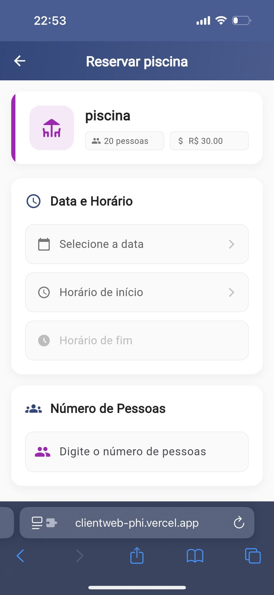

Interface para agendamento de espaços comuns, com seleção de data, horário e número de pessoas.

---

### Tela de Minhas Reservas

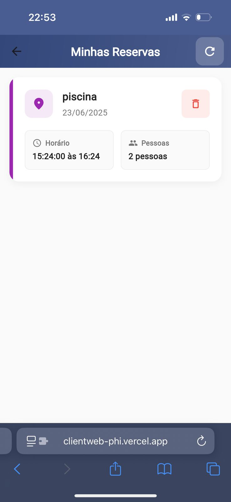

Lista todas as reservas realizadas pelo morador, com data, horário, quantidade de pessoas e opção de cancelamento.

# 7. Avaliação da Arquitetura

_Esta seção descreve a avaliação da arquitetura apresentada, baseada no método ATAM._

## 7.1. Cenários

_Apresentam-se abaixo os principais cenários de testes utilizados para demonstrar o atendimento aos requisitos não funcionais críticos da aplicação “Chama o Síndico”. Os cenários foram elaborados com base nas necessidades do sistema e das personas identificadas, cobrindo segurança de dados, interoperabilidade, disponibilidade..._

---

**Cenário 1 – Segurança e Privacidade dos Dados**

_Um morador acessa o aplicativo para registrar uma ocorrência referente a um problema no condomínio. Ele espera que seus dados pessoais (nome, apartamento, telefone) estejam protegidos e não sejam expostos a outros moradores sem consentimento. O acesso à informação deve ser restrito apenas ao síndico e aos funcionários autorizados._

- **Requisito Relacionado:** RNF002, LGPD
- **Estímulo:** Chat.
- **Resposta Esperada:**
- Apenas o síndico e os funcionários autorizados têm acesso às informações do apartamento dos moradores (dados sensíveis); fora isso, nenhum dado sensível é compartilhado com outros usuários.
- Consentimento explícito é solicitado para uso de dados pessoais.

---

**Cenário 2 – Interoperabilidade**

_O aplicativo precisa ser acessível tanto via navegador web quanto por smartphones Android e iOS, mantendo a mesma experiência de uso e sincronização de dados em tempo real._

- **Requisito Relacionado:** RNF003
- **Estímulo:** Um morador faz uma reserva pelo aplication; outro visualiza o status atualizado no site.
- **Resposta Esperada:**
- As alterações são refletidas em todas as plataformas quase instantaneamente.
- Não há inconsistências entre as versões mobile e web.

**Cenário 3 – Criptografia de Senhas:**

_O sistema deve garantir que todas as senhas dos usuários sejam armazenadas de forma segura utilizando algoritmos de criptografia_

- **Requisito Relacionado:** RNF006
- **Estímulo:** Um usuário realiza cadastro no sistema fornecendo email e senha
- **Resposta Esperada:**
- Senha que o usuário cadastrou precisa ser armazenada de forma criptografada. 
---

## 7.2. Avaliação

_Apresente as medidas registradas na coleta de dados. O que não for possível quantificar apresente uma justificativa baseada em evidências qualitativas que suportam o atendimento do requisito não-funcional. Apresente uma avaliação geral da arquitetura indicando os pontos fortes e as limitações da arquitetura proposta._

| **Atributo de Qualidade:** | Usabilidade / Portabilidade |
| --- | --- |
| **Requisito de Qualidade** | O sistema deve ser compatível com os principais navegadores web (Chrome, Opera, Edge, Safari) e sistemas operacionais móveis (Android, iOS). |
| **Preocupação:** | Garantir que a aplicação seja executada corretamente e de forma responsiva nos diferentes navegadores e plataformas mais utilizadas pelos usuários. |
| **Cenários(s):** | Cenário 2 |
| **Ambiente:** | Sistema em operação normal, acessado por diferentes navegadores e dispositivos móveis. |
o **Estímulo:** | Usuário acessa o sistema via navegador em desktop (Chrome, Opera, Edge, Safari) ou em smartphone com Android/iOS. |
| **Mecanismo:** | O sistema foi desenvolvido utilizando o framework Flutter, que permite a geração de aplicações responsivas e multiplataforma a partir de um único código-fonte. A compatibilidade com navegadores (Chrome, Opera, Edge, Safari) e sistemas operacionais móveis (Android) foi garantida por meio de testes manuais realizados nos dispositivos e navegadores alvo. |
| **Medida de Resposta:** | A aplicação deve funcionar corretamente, com boa usabilidade e renderização consistente, em todos os navegadores e sistemas operacionais testados. |

**Considerações sobre a arquitetura:**

| **Riscos:** | Diferenças de renderização entre navegadores podem afetar a experiência do usuário. |
| --- | --- |
| **Pontos de Sensibilidade:** | Elementos de UI baseados em tecnologias modernas de CSS podem apresentar inconsistências em navegadores mais antigos. |
| _ **Tradeoff** _ **:** | O esforço adicional para garantir compatibilidade amplia a manutenção, mas aumenta a acessibilidade e o alcance do sistema. |

- **Renderização da aplicação no navegador Google Chrome**  
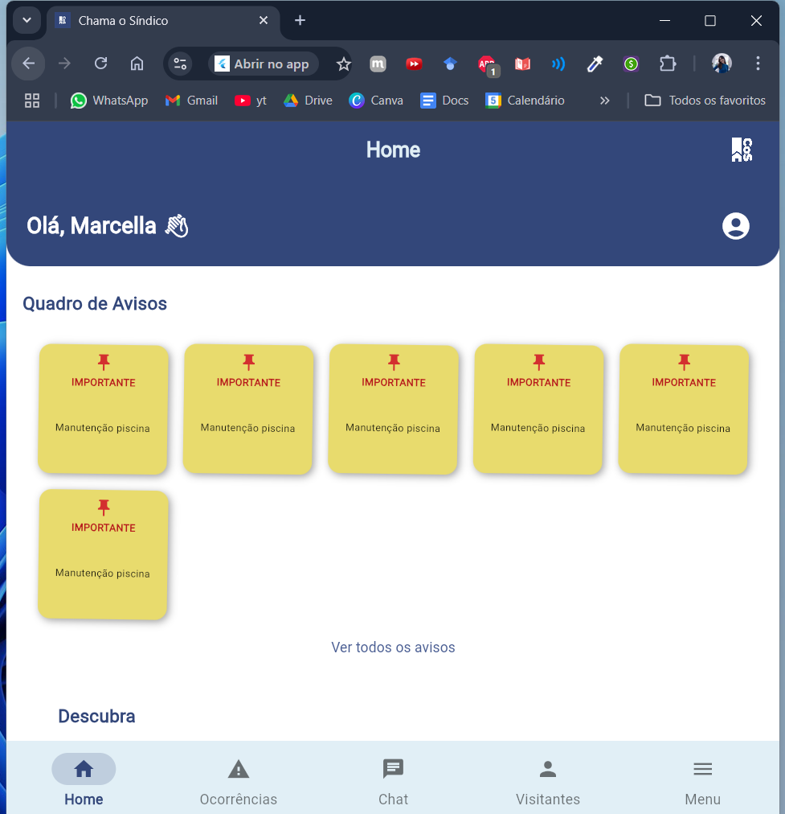

- **Renderização da aplicação no navegador Opera**  
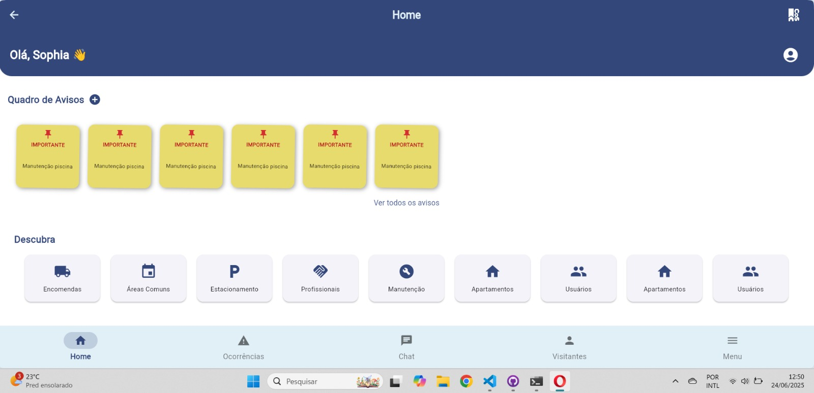

- **Renderização da aplicação no navegador Safari**  
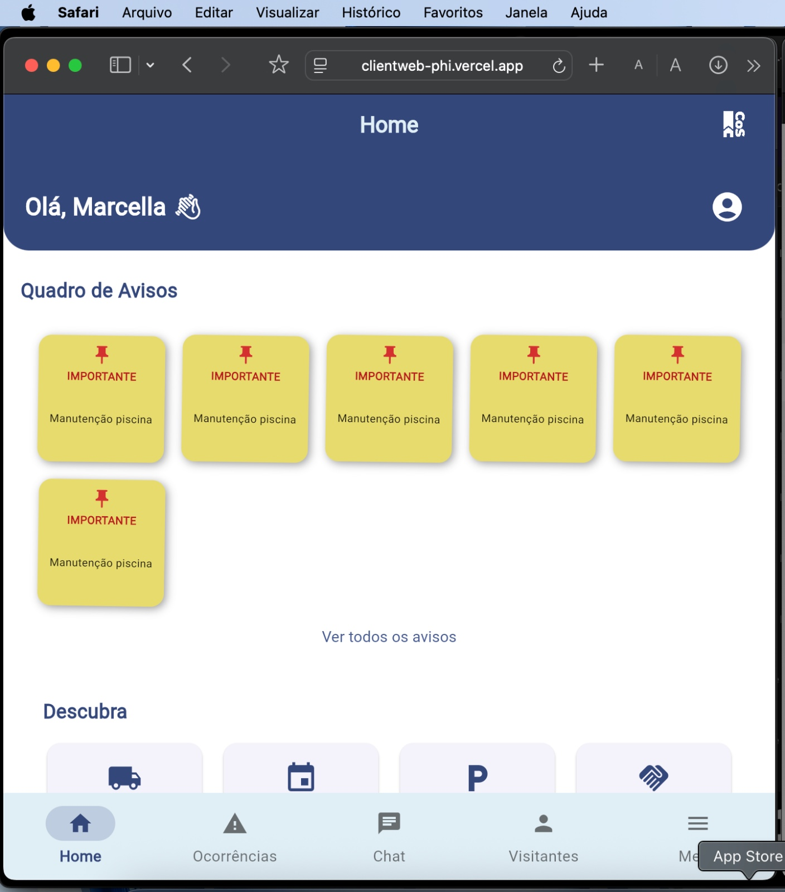

- **Renderização da aplicação no navegador Microsoft Edge**  
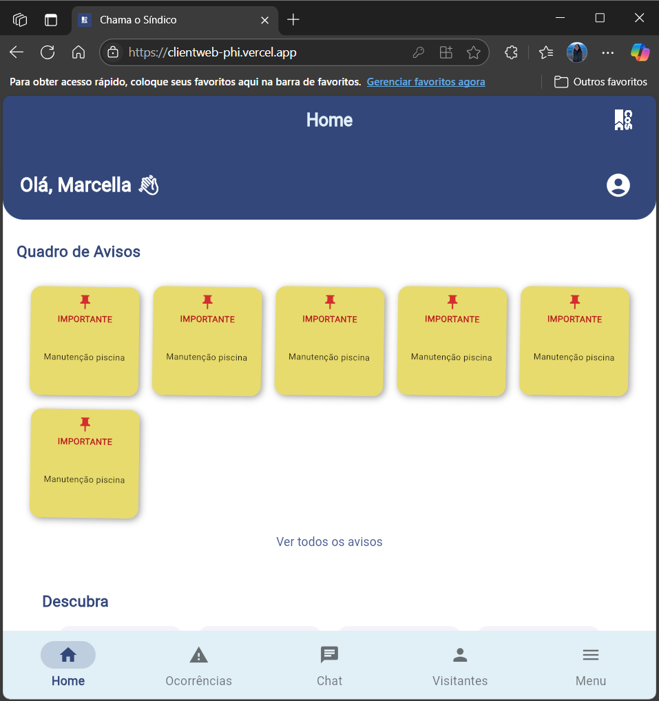

- **Execução da aplicação em dispositivo Android**  
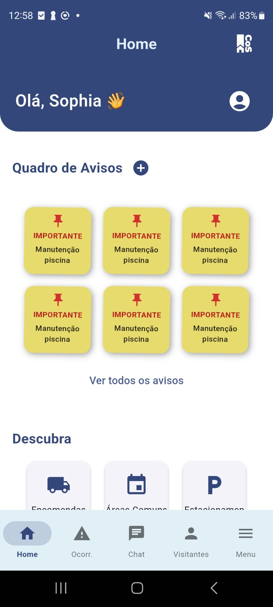

| **Atributo de Qualidade:** | Segurança |
| --- | --- |
| **Requisito de Qualidade** | Senhas de usuários devem ser armazenadas de forma criptografada |
| **Preocupação:** | As senhas dos usuários devem ser protegidas contra acesso não autorizado, mesmo em caso de comprometimento do banco de dados, garantindo que não possam ser recuperadas em texto plano. |
| **Cenários(s):** | Cenário 3 |
| **Ambiente:** | Sistema em operação normal com banco de dados ativo |
| **Estímulo:** | Usuário realiza cadastro no sistema |
| **Mecanismo:** | O servidor de aplicação NestJS utiliza a biblioteca bcrypt com salt rounds de 10 para criptografar senhas durante o registro. No processo de autenticação, a senha fornecida é comparada com o hash armazenado, sem necessidade de descriptografar a senha original. |
| **Medida de Resposta:** | 100% das senhas devem estar criptografadas no banco de dados, com tempo de processamento inferior a 10 segundos. |

**Considerações sobre a arquitetura:**

| **Riscos:** | Salt rounds muito baixo pode comprometer a segurança e vulnerabilidades na biblioteca bcrypt ou JWT |
| --- | --- |
| **Pontos de Sensibilidade:** | **Salt rounds (10):** Balance entre segurança e performance. **UsersRepository:** Ponto único de acesso aos dados de usuário |
| **Tradeoff:** | **Segurança vs. Performance:** bcrypt rounds 10 vs. tempo de resposta. **JWT Expiration:** 1 hora vs. segurança de sessão. **Validação vs. Performance:** Verificação de usuário em cada request vs. cache |

- 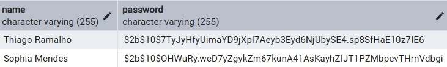

Evidências dos testes realizados

| **Atributo de Qualidade:** | Segurança / Privacidade de Dados |
| --- | --- |
| **Requisito de Qualidade** | Os dados sensíveis dos moradores devem ser protegidos e só podem ser acessados por síndico e funcionários autorizados, mediante consentimento explícito do usuário conforme LGPD. |
| **Preocupação:** | Garantir que nenhum dado sensível (nome, apartamento, telefone) seja compartilhado sem autorização e que o tratamento dos dados esteja em conformidade com a legislação vigente (LGPD). |
| **Cenários(s):** | Cenário 1 |
| **Ambiente:** | Sistema em operação normal durante o cadastro de novos usuários. |
| **Estímulo:** | Novo usuário realiza cadastro na plataforma e é solicitado a aceitar o termo de consentimento para uso de dados pessoais. |
| **Mecanismo:** | Durante o processo de cadastro, o sistema exibe obrigatoriamente o termo de consentimento de uso de dados pessoais. O cadastro só é concluído se o usuário marcar explicitamente a opção de concordância. No sistema, as funcionalidades que envolvem o acesso aos dados dos apartamentos dos usuários são restritas no frontend, estando disponíveis apenas para funcionários autorizados e para o síndico.|
| **Medida de Resposta:** | 100% dos cadastros exigem aceite explícito do termo de consentimento. Dados sensíveis não ficam acessíveis a outros moradores. |

**Considerações sobre a arquitetura:**

| **Riscos:** | Possibilidade de usuários tentarem burlar a obrigatoriedade do consentimento via manipulação de requisições; risco de exposição acidental de dados caso haja falha nas regras de permissão. |
| --- | --- |
| **Pontos de Sensibilidade:** | Implementação correta da lógica de exibição e registro do consentimento; controle de acesso no backend. |
| **Tradeoff:** | Exigir consentimento pode tornar o fluxo de cadastro ligeiramente mais longo, mas garante conformidade legal e aumenta a confiança do usuário. |

**Evidências dos testes realizados:**

Durante os testes, foi verificado que:
- O formulário de cadastro bloqueia o envio caso o termo de consentimento não seja marcado.
- Ao tentar acessar dados sensíveis, apenas usuários com perfil de síndico ou funcionário autorizado conseguem visualizar as informações.

| **Atributo de Qualidade:** | Confiabilidade e Desempenho |
| :--- | :--- |
| **Requisito de Qualidade** | Notificações de novos avisos devem ser entregues de forma assíncrona e confiável, sem impactar a performance da API principal. |
| **Preocupação:** | A criação de um aviso na API não deve bloquear a resposta ao usuário. O processo de notificação, que pode ser demorado, deve ser executado em segundo plano de forma garantida, mesmo em caso de picos de uso. |
| **Cenário(s):** | Cenário 1: Criação de um novo aviso no sistema. |
| **Ambiente:** | Sistema em operação na plataforma Render, com os serviços "Web Service (server)" e "Background Worker (sindico-consumer)" ativos e conectados ao broker de mensageria Kafka. |
| **Estímulo:** | Um usuário com as devidas permissões (ex: síndico) realiza uma chamada `POST` para o endpoint da API REST responsável por criar um novo aviso. |
| **Mecanismo:** | A arquitetura utiliza um padrão Publish-Subscribe. A **API REST (Web Service)**, ao receber a requisição, persiste o aviso no banco de dados e imediatamente atua como **Producer**, publicando um evento no tópico Kafka `"avisos-criados"`. O **Background Worker** atua como **Consumer**, escutando este tópico. Ao receber a mensagem, ele inicia o processo de buscar os usuários e enviar as notificações push através do serviço externo Firebase Cloud Messaging (FCM). |
| **Medida de Resposta:** | O sucesso da operação é verificado através dos logs em tempo real dos dois serviços na Render: **(1)** O log do "Web Service" deve exibir a mensagem de sucesso do Producer ao emitir o evento para o Kafka. **(2)** Em seguida, o log do "Background Worker" deve exibir as mensagens que confirmam o recebimento do evento, o processamento e o envio bem-sucedido das notificações via Firebase. |

**Considerações sobre a arquitetura:**

| | |
| :--- | :--- |
| **Riscos:** | **Complexidade:** A introdução de um sistema de mensageria (Kafka) e um serviço de worker separado aumenta a complexidade de desenvolvimento e depuração em comparação com uma arquitetura monolítica síncrona. |
| **Pontos de Sensibilidade:** | **Escalabilidade do Consumer:** O número de instâncias do "Background Worker" é um ponto sensível. Um único worker pode se tornar um gargalo se o volume de avisos (eventos) for extremamente alto.   **Latência da Rede/FCM:** O tempo total para a entrega da notificação é sensível à latência do serviço do Kafka e, principalmente, do serviço externo Firebase Cloud Messaging. |
| **_Tradeoff_ :** | A arquitetura troca a **simplicidade** de um processo síncrono pela **alta performance da API**, **resiliência** e **escalabilidade**. A complexidade adicional do worker e da mensageria é justificada pela garantia de que a interface do usuário tenha respostas rápidas e que o sistema de notificações não falhe durante picos de uso, podendo ser escalado de forma independente da API principal. |

---

### Evidências da Execução do Teste
**Figura 1: Log do Web Service (Producer)**

*A imagem exibe o log do serviço `server`, confirmando que, após a criação do aviso, o evento foi produzido e enviado com sucesso para o tópico Kafka "avisos-criados".*

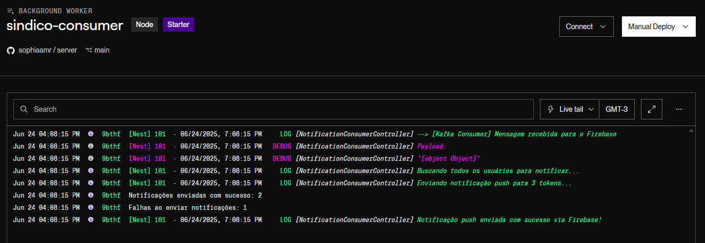

**Figura 2: Log do Background Worker (Consumer)**

*A imagem exibe os logs do serviço `sindico-consumer`, que demonstram o recebimento da mensagem do Kafka, o processamento da lógica de notificação e a confirmação final de que as notificações push foram enviadas com sucesso através do Firebase.*

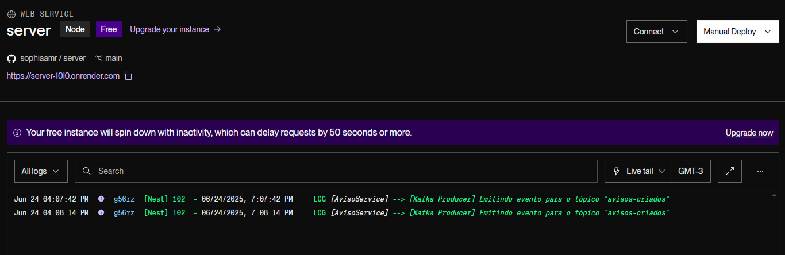

# 8. APÊNDICES

_Inclua o URL do repositório (Github, Bitbucket, etc) onde você armazenou o código da sua prova de conceito/protótipo arquitetural da aplicação como anexos. A inclusão da URL desse repositório de código servirá como base para garantir a autenticidade dos trabalhos._

## 8.1 Ferramentas

| Ambiente  | Plataforma              |Link de Acesso |
|-----------|-------------------------|---------------|
|Repositório de código | GitHub | [https://github.com/ICEI-PUC-Minas-PMGES-TI/pmg-es-2025-1-ti5-chamaosindico](https://github.com/ICEI-PUC-Minas-PMGES-TI/pmg-es-2025-1-ti5-chamaosindico) | 
|Hospedagem do front-end | Vercel |  [https://clientweb-phi.vercel.app/](https://clientweb-phi.vercel.app/)| 
|Hospedagem do back-end | Render |  [https://server-10l0.onrender.com/api/](https://server-10l0.onrender.com/api/)| 

